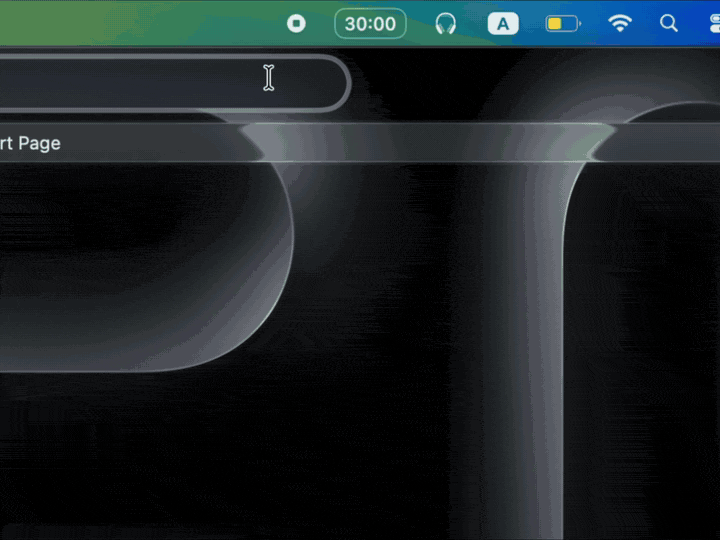

# elaps

menu bar timer and pomodoro for macOS.

<p align="center">
  
</p>

timer screen inspired by [onigiri](https://apps.apple.com/us/app/onigiri-minimal-timer/id1639917298). pomodoro is my own.

### install

>_for macOS 13+_

<a href="https://github.com/natagapova/macos-timer/releases/latest/download/elaps-v1.3.0-macos.zip" target="_self"></a>

1. download, unzip and move `elaps.app` to your `/Applications` folder.
2. if macOS warns about an unidentified developer on first launch, run this once in Terminal:

    ```bash
    xattr -cr /Applications/elaps.app
    ```

3. open from Applications. it lives in the menu bar. click the label to open, click outside to close, ⋯ → quit to exit.

### build from source

```bash
killall elaps 2>/dev/null; xcodebuild -project elaps.xcodeproj -scheme elaps -configuration Debug -derivedDataPath build CODE_SIGN_IDENTITY="-" CODE_SIGNING_ALLOWED=NO build && open build/Build/Products/Debug/elaps.app
```
